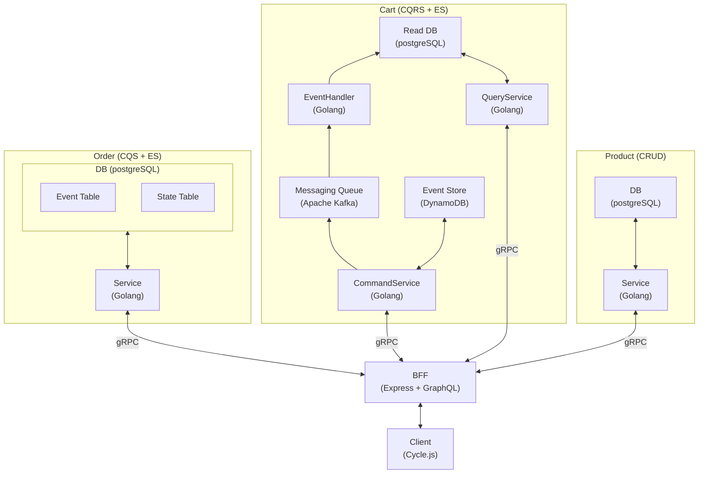
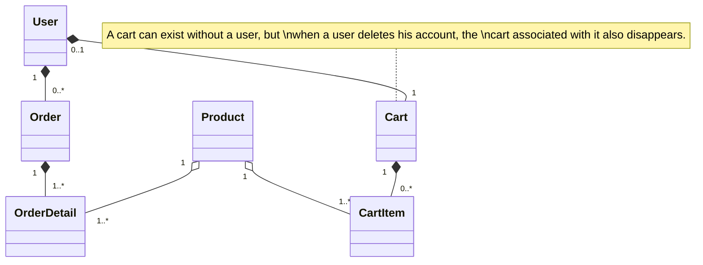
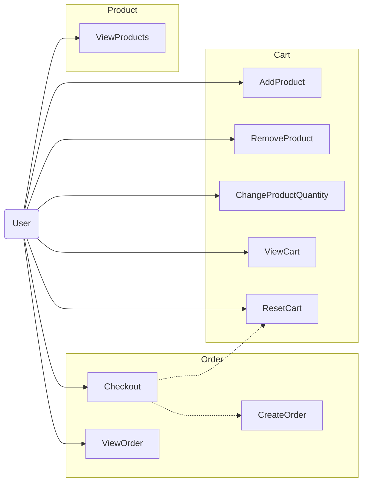

# e-commerce-microservices-demo-v1

## Architecture Diagram

```mermaid
flowchart BT
  Client["Client\n(Cycle.js)"]
  BFF["BFF\n(Express + GraphQL)"]

  subgraph Product["Product (CRUD)"]
    ProductService["Service\n(Golang)"]
    ProductDB["DB\n(postgreSQL)"]
  end

  subgraph Cart["Cart (CQRS + ES)"]
    CartCommandService["CommandService\n(Golang)"]
    CartQueryService["QueryService\n(Golang)"]
    CartEventHandler["EventHandler\n(Golang)"]
    MessagingQueue["Messaging Queue\n(Apache Kafka)"]
    CartEventStore["Event Store\n(DynamoDB)"]
    CartReadDB["Read DB\n(postgreSQL)"]
  end

  subgraph Order["Order (CQS + ES)"]
    OrderService["Service\n(Golang)"]
    OrderDB["DB\n(postgreSQL)"]
    subgraph OrderDB["DB (postgreSQL)"]
      OrderEventTable["Event Table"]
      OrderStateTable["State Table"]
    end
  end

  Client <--> BFF
  BFF <--"gRPC"--> ProductService
  BFF <--"gRPC"--> CartCommandService
  BFF <--"gRPC"--> CartQueryService
  BFF <--"gRPC"--> OrderService
  ProductService <--> ProductDB
  CartCommandService <--> CartEventStore
  CartCommandService --> MessagingQueue --> CartEventHandler --> CartReadDB
  CartQueryService <--> CartReadDB
  OrderService <--> OrderDB
```

## Domain Modeling

### Class Diagram

```mermaid
classDiagram
  class User {
  }

  class Order {
  }

  class OrderDetail {
  }

  class Cart {
  }

  class CartItem {
  }

  class Product {
  }

  User "1" *-- "0..*" Order
  User "0..1" *-- "1" Cart
  note for Cart "A cart can exist without a user, but \nwhen a user deletes his account, the \ncart associated with it also disappears."
  Order "1" *-- "1..*" OrderDetail
  Product "1" o-- "1..*" CartItem
  Product "1" o-- "1..*" OrderDetail
  Cart "1" *-- "0..*" CartItem
```

### Use Case Diagram

```mermaid
graph LR
  User(User)

  subgraph Product
    ViewProducts
  end

  subgraph Order
    Checkout
    CreateOrder
    ViewOrder
  end

  subgraph Cart
    AddProduct
    RemoveProduct
    ChangeProductQuantity
    ViewCart
    ResetCart
  end

  User --> ViewProducts
  User --> AddProduct
  User --> RemoveProduct
  User --> ChangeProductQuantity
  User --> ViewCart
  User --> ResetCart
  User --> Checkout
  User --> ViewOrder
  Checkout -.-> ResetCart
  Checkout -.-> CreateOrder
```
