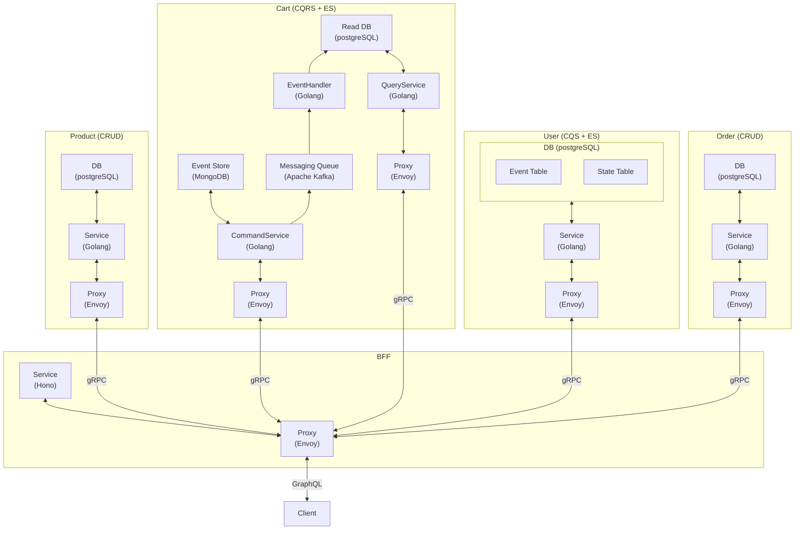
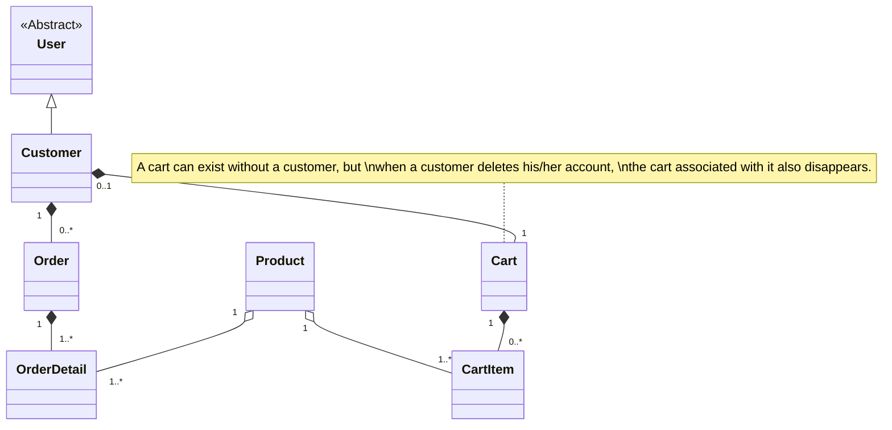
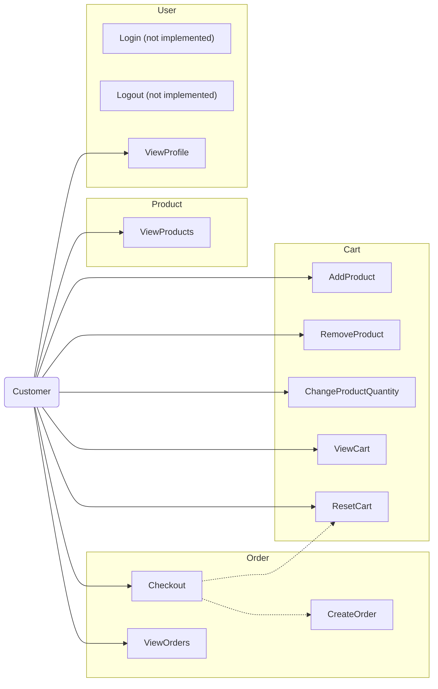

# e-commerce-microservices-demo-v1

This project is a demonstration of a microservices architecture implementation for an e-commerce application.  
The system design of this application is somewhat overstated and is not necessarily the correct representation for a real e-commerce application.

Currently, authentication or authorization mechanisms are not implemented.

## Technology Stack

- Container Technology
  - Docker
  - Docker Compose
- Container Orchestration
  - Kubernetes (minikube)
- Database
  - PostgreSQL
  - MongoDB
- Streaming Platform
  - Apache Kafka
- Proxy Server
  - Envoy
- Server Side
  - Golang
    - Echo
  - Node.js
    - Hono
- API
  - GraphQL
  - gRPC
- Frontend
  - Coming soon...

## Server Side Architecture Diagram

## Domain Modeling

### Class Diagram

### Use Case Diagram

